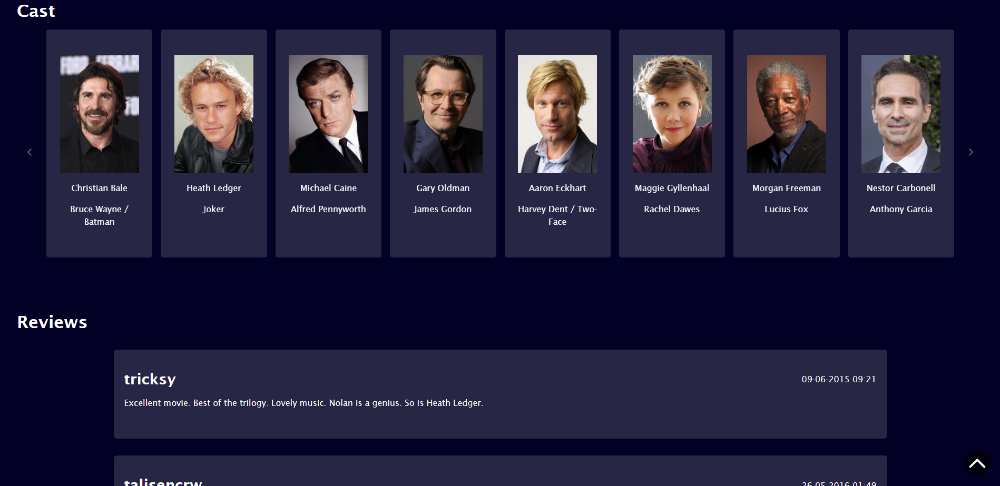

# MoviesApp

This project was generated with [Angular CLI](https://github.com/angular/angular-cli) version 16.1.8.

## About

Project hosted on: https://magical-sunburst-005073.netlify.app/

Tech stack: Angular 16, PrimeNG, ngx-translate, Boostrap 5, RxJS, TypeScript, HTML, SCSS

Movie database which consists of detailed info about movies and
actors. Page allows to translate its content to polish or english.
App is using public API for backend named TMDB.

## Now playing and top rated movies

## Movie page

## Movie cast and reviews

## Actor page

## Actor's movie credits

